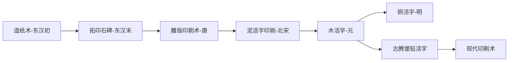

[toc]

# 印刷起源

印刷的本质思考？写字，盖章，画画，SMT （表面贴装技术 Surface Mounted Technology ）？

数字冷知识：

油墨的厚度多少？[^1]

可见光波长？[^2]

人手触觉可以感知的厚度变化最小大概是多少?[^3]



## 中国

汉朝蔡伦（970年—1051年）改良纸的生产以后，书写材料轻便、经济多了，但是抄写书籍还是非常费工的，远远不能适应社会的需要。直到东汉末年，出现了摹印和拓印石碑的方法

印刷术是中国古代汉族劳动人民的四大发明之一 。它开始于唐朝的雕版印刷术，唐朝中后期已经普遍使用雕版印刷术。宋朝虽然发明了活字印刷术，但是宋朝没有普遍使用活字印刷术。宋朝普遍使用的仍然是雕版印刷术。

北宋庆历间中国的**毕昇发明的泥活字**，标志着活字印刷术的诞生。比德国人约翰内斯·古腾堡的铅活字印刷术早约400年。元代王祯成功创制木活字，又发明了转轮排字。明代中期，铜活字在江苏南京、无锡、苏州等地得到较多的应用。

但目前没有毕昇的实物（印刷品或工具）留下，只存在于记载中。

## 国外

**约翰·古腾堡**（1398年—1468年2月3日，又有翻译为古登堡）**发明的活字印刷机**，标志着活字印刷术在欧洲的首次应用。他合成了一种十分实用的锌、铅和锑合金用来制作金属活字，和一种含油墨水以供印刷机使用，以及一款使用类似农用螺旋压机的木制印刷机。他将这些元素开创性地集合在他发明的印刷机里，成为一套非常实用的系统，可以经济且高效地批量印刷书籍。他的主要成就——《古腾堡圣经》，享有极高的美学及技术价值之美名。

作为现存西方第一部完整的印刷书籍的四十二行本《圣经》（即古腾堡圣经）使他流芳百世。这本圣经是世界印刷史上的杰作，流传至今的谷腾堡印刷的其他作品有三十一行版圣经和十行版“赎罪券”。

重点：

1. 铅活字的金属比例，以至于直到现代社会这个合金比例也没有大的变化
2. 脂肪性油墨——改善了印刷质量。

# 现代印刷

## 高端印刷

### 种类

邮票印刷方法有6六种，但主要是**胶版，影写版，雕刻版**

**一、雕刻版**

雕刻版属凹版印刷( recess print )的一种，油墨在印版的凹陷处，印刷时凹陷处的油墨粘到纸上。雕刻版印刷的原版是雕刻艺术家运用线条和点子表现图案深浅明暗的层次，用手工在钢板上精雕细刻加工而成。印刷到纸上显现出清晰的线点，用放大镜观察时雕刻线条像浮雕一样有绘画笔触似的刀锋，用手指在纸上轻轻抚摸时图象轮廓处明显地在凸起的手感。雕刻版印刷既富有版画的艺术性，又难于仿制伪造，所以是印刷钞票、邮票等最理想的方法，不足之处是颜色单调，制作成本高，在我国发行的邮票中雕刻版最少。


通过点和线的搭配，线条粗细，颜色深浅的变化就展现了大千世界。


第一枚真正意义上的邮票—— 黑便士，是由英国“邮票之父”罗兰·希尔爵士发明的，黑便士邮票于1840年正式面世。


相关的价格和说明，带水印雕版


**二、影写版**

　　影写版也称照相凹版，它具有网纹细，版纹深的优点，能印制出鲜艳浓郁的色彩和丰富细腻的层次，表现能力很强，是当今世界各国印制邮票比较常用的印刷方法之一。影写版的网纹不同于胶版和凸版，前者的网点大小一致，而以网点深浅来表现层次变化；后两种则是以网点的大小表现浓淡层次。用放大镜观察就能看出有明显的差别。同样是影写版印制的邮票，由于艺术设计和印刷工艺的不同，各国都有自己的特色。如瑞士、英国的精致秀丽；匈牙利的富丽多彩；日本的淡雅细腻。我国用影写版印制邮票始于1959年，从无到有，由简而繁，也积累了一定的经验，有自己的风格。

因为影写版印刷机是世界上各国控制的专有印刷机。所以不是一般印刷厂能拥有的，这也就是说明了影写版邮票的假票少，因为没有机器印刷。
我国的影写版邮票只有北京邮票厂印制，辽宁沈阳和河南邮电印刷厂只印制胶版邮票。

下图是一枚英国的影写版邮票：


放大后，我们看到图案都是有菱形的色块点阵组成的，并且单个菱形块中间都是空心空白的，所以影写版的特点就是--“空心菱形”大家看影写版邮票的文字，肉眼看是平滑整齐的，但是放到来看，居然也是菱形组成的，是毛边的。


英国印刷水平高，不是那么特别明显，咱们来看看我国的。


放大看看诸葛孔明先生,菱形是不是很明显,脸上的都是空心菱形。


**三、胶版**

胶版印刷是通过照相制版后印刷，也称平版印刷，世界最早的胶版邮票发行于1843年的瑞士。

胶印版是一种间接印刷方法，先把印版图案上的油墨印到包有胶皮的滚筒上面，然后在转印到纸上

现代的胶版制版技术已发展为平凹版，其复制能力很强，各种体裁的绘画原作，黑白、彩色照片或各种印刷品，都可以很逼真地复制翻印。胶版印刷的网纹与照相凹版不同，是运用网点的大小来表现层次深浅变化的。同时各种颜色版所用的网纹角度不同，所以印刷的各种颜色的网点都是岔开的，呈现出“六角纹”、“金钱纹”等美观的花纹。文字、线条和底色则可用无网实地印刷，效果平服光洁，秀丽完整，其效果比照相凹版好得多。这些特点在放大镜下可以看得很清楚，可以藉以鉴别胶版印刷的特征。

在40倍的放大镜下观察，可看到图案由一个个**成点阵的实心圆点**组成；而文字则是全部实心的，**边缘比较平整**。

胶版印刷质量好，成本低，是印刷邮票很好的方法，但是胶印品比较容易仿制，这是胶版印刷的弱点。为了防止被伪造，胶版邮票的纸张和油墨都是特制的，含有特殊化学成分，以便通过化验可以鉴别真伪。现代较多用胶版印刷邮票的国家有古巴、加拿大、保加利亚等。我国1962年发行的特49《中国民间舞蹈》（第一组）和1963年发行的特58《民间玩具》邮票，都是胶版印刷的，其印刷效果色彩明快，层次细腻，文字清晰，很有特色。

例如1992年10月28日发行的《党的好干部–焦裕禄》纪念邮票，就是胶印。


胶版印刷通过网纹的大小来表现色调的浓淡和层次的深浅，而在文字、线条和平涂色块上，却采用无网纹的实地印刷，不仅平服光洁，还清晰完整。


**区别**：

胶版印刷通过网纹的大小来表现色调的浓淡和层次的深浅，而在文字、线条和平涂色块上，却采用无网纹的实地印刷，不仅平服光洁，还清晰完整。

影写版和胶板区别非常大，区别于胶板的网纹，影写版是以网点深浅表现色彩层次的，具有网纹细、层次丰富的特点。

放大观察，我们会发现有很多金钱的圆圈一个连着一个。这就是胶版的特色，“金钱纹”。
中间传白衬衣的人的裤子，放大看，是有一片方形点阵组成的，这是胶版的另外一个特点，“点阵”。


分辨的一个关键点就是看文字，假的是翻拍制版的，所以文字不是清晰纯色，而变成了多色“金钱纹”。

**四、影雕套印**

　　影雕套印就是雕刻版和影写版混合套印，虽然雕刻版印刷富有版画般的艺术性，且能防止伪造，但是却难于表现丰富的色彩和细腻的层次，而影写版正好能够弥补这个缺陷。影写版也有缺点，版纹深、墨量大，而且油墨是黏性极小的液体，用挥发性强的甲苯作溶剂的，所以在深层次处往往呈现出不规则的水纹，破坏了邮票画面的细腻美观；另外，由于影写版印刷的版纹，全部是由不同深度的网纹组成的，因此在细线条或细文字处，往往呈现出锯齿形的碎点，影响印刷效果的光洁完整，而雕刻凹版恰好运用其粗犷挺拔的线点，以补充影写版的某些不足。为了把邮票印制得更加完美，人们就采用雕刻版和影写版温柔合套印的方法，在工艺上发挥这种印刷方法的长处，两者相辅相成，互为补偿，藉以得到更为理想的印刷效果。


**五、胶雕套印**

胶版和雕版套印的技术，同样是一种混合工艺。两种工艺技术的合用，以长补短，在美观上呈现出的效果，确实是单一种工艺所不能达到的。

**六、特殊凹版**
在我国邮票印刷上已经采用过的几种特殊凹版工艺，是邮票印刷工作者研究创新的几种从凹版印制技术中派生出来的新技术，具有独特的风格和有趣的差异。

**6.1、线条腐蚀版**
俗称假雕刻，这种方法一般是用于没有半色调层次的文字线条稿，如我国印制的《国歌》邮票。

**6.2、间接凹版**
雕刻原钢版手刻完成后，冲压在透明的有机玻璃一成为阳片，再晒版用胶版印刷，点线光洁饱满，层次丰富完整，粗看与雕刻版印刷一模一样，唯油墨是平面的，用手摸时没有油墨凸起的手感。因这种制版方法是用原钢版直接复制晒版的，不易伪造，且成本低，效果好，故很多国家用这种印刷方法印刷钞票、邮票等。

**七、凸版**
凸版印刷是照相分色后用铜版制版印刷的。它的印刷与凹版正好相反，图纹着墨部分凸起，而空白部分是凹下的。凸版印刷的图纹与平版相同，也是网点大小表现层次，而文字和底色一般都不加网纹，用实地印刷。由于凸版印刷的压力较重，轼而在印刷品图纹的边缘处往往留下油墨外溢的痕迹，这是识别凸版邮票的特征之一。用放大镜观察就可以看得很清楚。世界上联邦德国、罗马尼亚等国家印制凸版邮票比较多。

### 辨伪

【胶版邮票如何鉴别真伪】
胶版印制的邮票，印刷线数远远高于市面上平常胶板印刷机的印刷线数。真品，要用40倍以上放大镜，才能看清印刷网点。赝品，基本上凭肉眼即可分辨印刷网点。

【影写邮票辨伪】
用放大镜看网点。就可放心地分辨出真假邮,不管是胶版和影写版邮票上文字,
都是用一种油墨所印制,发现票面文字由多种油墨套印出来,皆为假票。

【雕版邮票辨伪】

用眼看：邮票正面油墨的线条呈凸起状，而纸张背面有凹进去的感觉；用放大镜观察，图纹上的线、点都凸起在纸面上，其最深处在光线照印下呈现出阴影。
用手摸：用手指轻轻触摸邮票表面，有很明显的凸起感。

### 其他工艺

珠光-含玉石粉01
珠光印刷是指使用珠光油墨的特殊印刷技术。由于珠光油墨有着蚌珠天然光泽使包装印刷品展现出犹如珠光宝气般的缤纷色彩，显得高贵典雅。


雕刻凹版02
目前的雕刻凹印基本上使用电雕机雕刻印版。

三维压凸03
　　三维压凸印是一系列协调有序的印刷和印后加工工艺的结合，最后图文能在纸面上形成凸起。


热烫04
　　热烫印刷的实质就是转印，是把电化铝上面的图案通过热和压力的作用转移到承印物上面的工艺过程。当印版随着所附电热底版升温到一定程度时，隔着电化铝膜与纸张进行压印，利用温度与压力的作用，使附在涤纶薄膜上的胶层、金属铝层和色层转印到纸张上。
烫金(金色氧化铝)压凸一次完成。


冷烫05
　　冷烫是印刷工艺技术的一种，利用专用胶水（油墨）将冷烫电化铝除基层以外的其他部分粘附在承印物表面，从而实现烫印的效果。


光油06
　　光油就是俗称的UV，是一种透明的涂料，也有人称之为UV清漆。其作用是喷涂或滚涂在基材表面之后，经过UV灯的照射，使其由液态转化为固态，进而达到表面硬化，其耐刮耐划的作用，且表面看起来光亮，美观、质感圆润。


### 印刷厂

**邮票印刷厂简介**

1991年以前，新中国发行的邮票主要由北京邮票厂独家印制（影写版机器最早是50年代从捷克引进的二手机器）。
1992年开始，允许印制邮票的厂增加到了四家。
在此期间，除北京邮票厂继续印制影写版、雕刻版邮票外，其余三家印制厂全部印制胶版邮票。
目前胶版邮票主要由河南省邮电印刷厂和辽宁省沈阳邮电印刷厂印制。
第四家上海印钞厂据说只印过两套票，之后就再没印过。

邮票和人民币的印刷以前大部分是由海外进口，比如进口德国海德堡印刷机，现在有一部分国产的。

## 印刷厂印刷

以进行报纸，书本，杂志印刷为代表，所使用的颜色为 CMYK，而不是编程中常见的RGB（光的三原色 红、绿、蓝）。


青色（Cyan）、品红色（Magenta）、黄色（Yellow）,而K取的是black最后一个字母K

 绘画时，我们知道了颜料的三原色：青、品红、黄；
 我们将三个颜色的油墨，分别两两叠加，看看得到的效果：
 C青 与 M品红 混合，可以得到蓝色；
 C青 与 Y黄 混合，可以得到绿色；
 M品红 与 Y黄 混合，可以得到红色；
 C青 + M品红 + Y黄 三色混合，可以得到黑色；


既然是CMY三原色，为什么会有K 黑色？

1. 由于油墨的制造水平，CMY三色叠加后，不可能达到纯黑的效果；
2. 三色油墨叠加后，才得到一个最常用的黑色，太浪费油墨；
3. 三色分别叠加印刷，印刷机会有套印误差，影响美观；
4. 多色油墨叠加后，油墨在纸张上太厚，不易干燥，易粘脏印刷品；
5. 黑色不纯，风景、人物等图像印刷时明暗对比效果差；
   所以在印刷时会单独使用一支黑色的油墨，专门用来印刷黑版，如黑色的文字等等；这样子既可以一次印刷出来，不用多色套印，又能得到更纯的黑色。
   总结
6. 通过印刷的三原色，我们可以得到更多的颜色；
7. 三色叠加可以形成黑色，但黑色不纯，印刷时也有其他问题；
8. 所以单独增加一个黑色油墨，使黑色更纯、更方便印刷。
9. 黑（Black）简写成 B 的话（ CMYB ？）容易与 Blue 混淆，就使用 K 替代；

## 普通办公

办公室或家庭的一般打印机

**针式打印机**

针式打印机是一种特殊的打印机，和喷墨、激光打印机都存在很大的差异，而针式打印机的这种差异是其它类型的打印机不能取代的，正是因为如此，针式打印机一直都有着自己独特的市场份额，服务于一些特殊的行业用户。

针式打印机的主要部件是打印头，通常所讲的9针、16针和24针打印机说的就是打印头上的打印针的数目。

1978年，爱普生公司发布了针式打印机（7针）TP-80，产品大获好评。 1980年，MP-80（9针）面世，同样在全球引起了轰动，第二年，MP-80在日本的市场占有率高达60%以上，在美国市场也获得了高度的评价，逐渐发展成为全球第一台适用于PC产品的主流针式打印机。

**思考：哪些场景适合针式打印机**？

**喷墨打印机**

喷墨打印机是在针式打印机之后发展起来的，采用非打击的工作方式。

喷墨打印机在打印图像时，需要进行一系列的繁杂程序。当打印机喷头快速扫过打印纸时，它上面的无数喷嘴就会喷出无数的小墨滴，从而组成图像中的像素。打印机头上，一般都有48个或48个以上的独立喷嘴喷出各种不同颜色的墨水。

优点：体积小、操作简单方便、打印噪音低、使用专用纸张时可以打出和照片相媲美的图片等等。

缺点：在使用过程中会加热墨水，而高温下墨水很容易发生化学变化，质不稳定，所以打出的色彩真实性就会受到一定程度的影响；另一方面由于墨水是通过气泡喷出的，墨水微粒的方向性与体积大小很不好掌握，打印线条边缘容易参差不齐，一定程度的影响了打印质量，所以多数产品的打印效果还不如压电技术产品。

**激光打印机**

其基本工作原理是由计算机传来的二进制数据信息，通过视频控制器转换成视频信号，再由视频接口/控制系统把视频信号转换为激光驱动信号，然后由激光扫描系统产生载有字符信息的激光束，最后是由电子照相系统使调制后的光束射入多面转镜，再经广角聚焦镜把光束聚焦后射至光导鼓（硒鼓）表面上。

硒鼓表面先由充电极充电，使其获得一定电位，之后经载有图文映像信息的激光束的曝光，便在硒鼓的表面形成静电潜像，经过磁刷显影器显影，潜像即转变成可见的墨粉像，在经过转印区时，在转印电极的电场作用下，墨粉便转印到普通纸上，最后经预热板及高温热滚定影，即在纸上熔凝出文字及图像。在打印图文信息后，清洁辊把未转印走的墨粉清除 ，消电灯把鼓上残余电荷清除，再经清洁纸系统作彻底的清洁，即可进入新的一轮工作周期。

## 商业打印

以Pos机为代表，华勤的POS机上就有打印机模块

一般为 热敏打印机 或 针式打印机

热敏打印机：

热敏打印机的工作原理是打印头上安装有半导体加热元件，打印头加热并接触热敏打印纸后就可以打印出需要的图案，其原理与热敏式传真机类似。图像是通过加热，在膜中产生化学反应而生成的。这种热敏打印机化学反应是在一定的温度下进行的。高温会加速这种化学反应。当温度低于60℃时，纸需要经过相当长，甚至长达几年的时间才能变成深色；而当温度为200℃时，这种反应会在几微秒内完成。

最普遍的热敏打印机使用一种带加热点阵的固定打印头，打印头设有320个方点,每一点为0.25mm×0.25mm。利用这种点阵，打印机可把打印点在热敏纸的任意位置上。这种技术已用于纸张打印机和标签打印机上。

打印声音很小，利用率比较高，传真机一般也是热敏打印机。

大家在点菜或便利店买东西时候一般都是用的这个，指甲一划纸张就会有黑色印记，热敏纸主要的成分是双酚A，双酚A确实有“一定”毒性，但是双酚A虽然有毒性，但是它是属于低毒性化学物质，在常温下，很稳定的，没有一定的剂量，是不会给人体带来伤害的。

## 工业打印

Zebra打印机同时支持热敏和热转印，打印速度快，效果好。

热转印技术很早就应用于织物热转移印花生产，随着高科技飞速发展，热转印技术应用越来越广泛。 从油墨品种分类有热压转印型和热升华转印型。从被转印物分类有织物、塑料（板、片、膜）、陶瓷和金属涂装板等；从印刷方式分类可分为网印、平印、凹印、凸印、喷墨和色带打印等；从承印物分类有热转印纸和热转印塑料膜等。

热转印特别适合制作印制包含全彩图像或照片的图案。 热升华转印是以具有热升华特性的染料制图，喷墨列印在热转印纸上，使用高温高压的机器将图案转印制布料上。经过加热烫压，墨水在高温下会升华成汽态，以气体分子态渗入材料，此种气态染料分子能轻易的进入纺织品的孔隙中，待温度下降，染料再度还原成固态，同时纺织品表面孔隙关闭凝固，颜色均可完全的渗入转印物的纤维中，不管视觉与触感皆一流并保有原有的透气与舒适感，水洗不掉色。

以美国Zebra打印机为代表


各种类型碳带


碳带材质、纸张材质，以及温度需要进行适配调整，以保持最佳显示效果和牢固度，满足客户及相关标准，常见的试验：

1、耐刮性试验
用拇指的指甲施加中等压力，在印完并已干燥在薄膜上的墨层处反复刮多次，如果墨层出现刮痕或油墨脱落则说明油墨的附着不理想。

2、耐胶带剥离性试验
使用黏胶带均匀粘到印刷样品上，并用手指在胶带的背面压一遍使之粘牢，然后用手抓住胶带的两端以中等速度拉起，观察油墨被胶带粘起的情况。只要胶带上有油墨就表明油墨在该种承印材料上的附着性不好。

3、耐干摩擦试验
将两张印样的印刷面相对叠放在一起，施加2—4磅的压力反复摩擦，有擦痕或油墨脱落则表明油墨附着性差。

4、耐湿摩擦试验
方法与上述耐干摩擦性试验类似，只是在两张印样中间需加一点水。

5、耐洗涤剂试验
在印样上滴一滴或数滴碱性洗涤剂，15秒后用纸巾或干净的软布或干净的软布将其吸干净，然后用中等压力擦拭，印刷的图文部分如有任何变化则表明油墨的附着性不好。

控制Zebra打印机，工厂可通过直接发送ZPL语言到打印机或发送图片给打印机，也可通过商业软件CodeSoft或Bartender等控制打印机，如下三种打印方法详细介绍：

1. 使用ZPL语言，打印机内置各类字体，自己用特殊脚本控制

   ```powershell
   type FILE.TMP > COM1
   或
   copy FILE.TMP > COM1
   ```

```shell
^xb 抑制回送
^pr 打印速度
^ll 标签长度
^mm 打印模式
^mt 受热纸型
^jz 出错重打
^ss 设标签传感器
^md 标签深度
^mn 标签深度
^jv 配置更新

^a 缩放/点阵字体

^a(可缩放/点阵字体)命令用于内置的true type字体。可缩放字体（也可以认为是平滑矢量字体）能够以点为单位来对横向、纵向进行扩展。点阵字体由点阵象素组成，通常高度高度大于宽度。

内置的的缩放字体(a0=cg triumvirate bold condensed)默认为不旋转，15点高，12点宽。打印机将从^a命令得到字体的旋转方向、宽度、高度等参数。

^a命令的格式：
^af,o,h,w
^a =    缩放/点阵字体
f =    字体名
默认值：0（cg triumvirate bold condensed)

其他值：a-z，0-9（打印机的任何字体，包括下载字体，eprom中储存的，当然这些字体必须用^cw来定义为a-z，0-9）
0 =    字体方向
默认值：^ fw默认值或上一个^ fw的值。
其他值：    n = 正常 （normal)
r = 顺时针旋转90度（roated)
i = 顺时针旋转180度（inverted)
b = 顺时针旋转270度 (bottom)
h =    字符高度
```

2. 利用Graphic类在自己程序中绘制出自己想要的打印效果图，然后用指令集中的DG指令将打印效果图整张通过TCP/IP或者串口传输到打印机打印

   方法一在打印中文以及字体选择上很不方便，就有了方法二，也就是利用自己擅长的编程语言通过Graphic类绘制出自己想要的效果图，然后再把整张图片传给打印机进行打印。
3. 利用Codesoft，NiceLabel，BarTender等第三方打印编辑软件，利用可视化界面（托拉拽）编辑好要打印的效果,然后调用打印机驱动进行打印，也可用SDK代码控制
   介绍：方法一二在更换打印效果模板时都需要程序员代码重新用敲出一个打印模板，工作量巨大，并且调试麻烦。方法三就解决了这个问题，他有像画图工具一样的可视化操作界面，用户可以自己做打印模板，并且可以通过托拉拽的方式进行打印效果的调整，也可以做到和数据库对接，做到每张标签打印出来的内容都不同。而且还可以导入pdf文件，各种矢量图等等，也可用代码进行控制

区别

| 方法       | 优点                                                                                                                                                                                                                                                          | 缺点                                                                                                                                                                                                                                                                                                                                                                                                                                                                                     |
| ---------- | ------------------------------------------------------------------------------------------------------------------------------------------------------------------------------------------------------------------------------------------------------------- | ---------------------------------------------------------------------------------------------------------------------------------------------------------------------------------------------------------------------------------------------------------------------------------------------------------------------------------------------------------------------------------------------------------------------------------------------------------------------------------------- |
| ZPL脚本    | 1.如果是打印效果很简单，比如就是打几个数字，英文字母，或者生产日期的那种，这种方式是最合适的，基本上只要花个几分钟就可以做好。``2.打印可以集成到别的软件中，标签上如果有变量的话比较方便，需要打印时只需要和打印机建立通讯，发送指定的指令即可实现打印 | 1.如果打印效果图中包含中文字符，或者对打印内容的字体有要求的话，这就不行了，自带的指令不能支持打中文，而且自带字体也是少的可怜，虽然说可以导入外部字体，但是对外部字体的大小有要求，而且每次开机都要重新调用一下，非常麻烦。``2.在调试页面效果的时候也很不方便，没有可视化界面，每次修改打印效果都需要手动修改参数，然后发给打印机打出来才能看到打印效果，不直观``3.没有可视化的操作界面，用户不能自己排版，添加其他模块等。程序一旦定了，打印效果需要二次修改的话很麻烦。 |
| 编程画图   | 1.打印字体不受限制，只要你电脑里有的就都能打印，中文什么的都不在话下<br />2.打印效果的调试比较方便，修改参数后你只要将图片在程序中进行显示就可以看得到效果，而不需要一定要打出来才能确认打印效果。                                                            | 1.由于采用的是图片传输给打印机打印，并非矢量图，如果字体较小，清晰度不够，那么打印出来的效果就很差，字很模糊。图片传过去的大小一定要控制好，不然会造成溢出标签或者没填充蛮标签等问题``2.打印的效果图只能编程人员根据客户需求设计，一点点画出来，没有类似画图工具一样的可视化操作界面不能客户自己修改，做一套打印效果模板成本太高。``3.采用方法二必须会编程的是程序员，否则无法生成效果图片。                                                                     |
| 第三方软件 | 1.可视化界面，调试方便``2.用户可以自己新建模板，做模板，操作非常简单。也可以和数据库建立连接，标签内容可以设置变量``3.软件可以导入PDF、矢量图等各种文件，大小调整非常方便，打印出来的效果很清晰。``                                      | 1.客户机需要安装打印机驱动，安装Bartender的Enterprise Automation版本，需要购买激活                                                                                                                                                                                                                                                                                                                                                                                                       |

# 打印编程

## 应用程序

在windows应用程序编程时，对于界面的绘制其实非常复杂，如果想自定义控件或界面都需要自己绘制，比如如果要实现改变线条的颜色，线条的大小，填充颜色，显示一张位图等。这些功能，我们就要使用GDI对象。不过GDI对象是要通过DC才能发生作用的。

在windows的任务管理器 -> 详细信息 -> 选择列，可以选择查看GDI对象


DC和GDI对象的使用步骤，则绘图的完整步骤为：

1. 获取或者创建一个DC
2. 获取或者创建一个GDI对象(Pen, Brush等)
3. 使用dc.SelectObject函数把GDI对象选入DC
4. 使用DC进行绘图或文字输出
5. 恢复DC原来的GDI对象并删除刚新创建的GDI对象，如pen.DeleteObject()
6. 释放或删除设备描述表DC

当绘制好界面后，我们可以直接将界面以图片方式打印到打印机上。

## Web打印

可以直接在页面上调用JS，但是效果可能一般

```javascript
window.print()
```

可以通过CSS 的@media print { ... } 控制特殊打印

```CSS
@media print {
    @page {
      /* 纵向打印 */
      // size: portrait;
      /* 横向打印 */
      size: landscape;
      /* 去掉页眉页脚*/
      margin-top: 0;
      margin-bottom: 0;
    }
 }
```

如果需要讲究精确控制，一般可以用后台(JAVA，C#，Python等)转换为PDF格式，比如JAVA使用 iText类库进行转换，比如一些参数说明如下

```java
import com.itextpdf.io.image.ImageDataFactory;
import com.itextpdf.kernel.color.Color;
import com.itextpdf.kernel.pdf.PdfDocument;
import com.itextpdf.kernel.pdf.PdfWriter;
import com.itextpdf.kernel.pdf.action.PdfAction;
import com.itextpdf.layout.Document;
import com.itextpdf.layout.Style;
import com.itextpdf.layout.border.SolidBorder;
import com.itextpdf.layout.element.Image;
import java.io.File;
import java.io.IOException;

/**
 * @author Bruno Lowagie (iText Software)
 */
public class ImageProperties {

    public static final String TEST1 = "src/main/resources/img/test/amb.jb2";
    public static final String TEST2 = "src/main/resources/img/test/butterfly.bmp";
    public static final String DEST = "results/appendix/image_properties.pdf";

    public static void main(String args[]) throws IOException {
        File file = new File(DEST);
        file.getParentFile().mkdirs();
        new ImageProperties().createPdf(DEST);
    }

    public void createPdf(String dest) throws IOException {
        // Initialize PDF document
        PdfDocument pdf = new PdfDocument(new PdfWriter(dest));

        Document document = new Document(pdf);

        Image img1 = new Image(ImageDataFactory.create(TEST1));
        img1.scaleToFit(100, 100).setDestination("Top");
        document.add(img1);
        Image img2 = new Image(ImageDataFactory.create(TEST2));
        img2.setHeight(300);
        document.add(img2);

        document.close();
    }
}
```

## 条码打印

一般情况下，我们对打印的效果要求可能不是那么高，基本能看清就可以了，但是对于条码（一维，二维），由于需要机器扫描，所以对打印的要求是比较高的。

如果想获得较好的效果，从2个方面入手

1. 使用较高DPI的打印机，一般设计打印内容的时候需要首先确定好打印机的DPI，不同DPI会直接影响打印标签的设计。
2. 使用更高识别精度的摄像头或扫描枪。

**打印条码的方法**：

1. 使用条码字体进行打印，这是最简单的办法，但是效果一般
2. 使用专门的函数库生成条码图形，比如 iText类库中就有条码函数，效果会好一点
3. 使用专业的打印软件生成或直接打印条码，效果最好

**注意事项**

1. 条码图形化后，是不能随意放大缩小的，一般只能按像素比例来放大，否则会导致打印效果欠佳。如果要放大缩小 1.5倍，可以考虑使用专业打印软件进行，会有一定的优化。
2. 不同的条码规格有各自的规则，比如不同的条码对包含的字符范围有限制，有些条码无法体现字符，有些无法显示中文；有些条码内部自带固定格式和校验码；有些条码长度有限制等等，需要根据场景选择不同的条码规则
3. 对于一些条码扫描枪，是以回车作为结束，所以对于内容中如果包含回车需要进行转义等特殊操作

常见的条码规格如下


一般来说一维条码用 Code128 压缩比高

二维码用 QR Code 或 PDF417，包含的内容比较多


华勤HQMTS的打印界面，可支持自定义分页，自定义函数，模板等多项功能


多年前华为对条码的要求：


印刷的条码等级标准简单介绍：条码的印刷等级是表示印刷质量好坏的指标等级，一般有A、B、C、D、F，使用条码检测仪根据印刷好坏判定的质量等级，A级为最好，F级为不合格，不合格的条码就是用条码扫描器也可能无法识读，而B C D 级根据需要判断是否合格，一般要求不严格的情况下，B、C级都可以认为是合格的。

# 感谢

感谢集邮达人王官军同学在邮票和印刷技术上的资料分享

感谢曾经开发和运维公司最早MES系统(HQMTS)的同学在打印问题上的支持

感谢华为，联想等大客户的指导和要求

[^1]: 印刷油墨厚度一般5-22微米
    
[^2]: 可见光波长范围 390nm-780nm
    
[^3]: 一般为几十微米，最小为13纳米，据说如果你的手指和地球样大，可以通过触摸感觉到房屋和汽车的区别 https://www.nature.com/articles/srep02617
